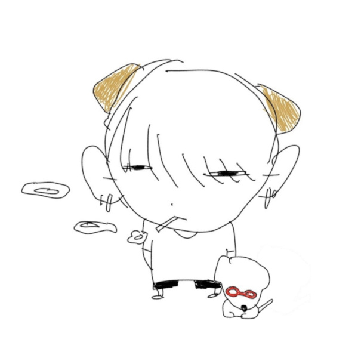
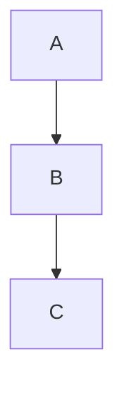

* 이상하게도 이 라인이 없으면 toc가 렌더링 되지 않는다.
{:toc}

# 1단계 헤더

이미지는  처럼 표시됨.

서식에 대한 테스트: **굵은 글씨**, 그리고 *기울어진 글씨*, 그리고 `코드블럭`은 이렇게 표시됨 [^1]

[^1]: 각주는 이렇게 표시됨

> 인용구 
> 테스트


## 2단계 헤더

코드 블럭은 아래와 같이 표시됨

```cpp
#include <iostream>

using namespace std;

int main() {
	cout << "Hello, World!" << endl;
}
```

워드 랩 테스트

```csharp
public class LocomotiveAction
{
	private void Awake()
	{
		Debug.Log("Awaked!");
		Debug.Log("Testing verrrrrry loooooooooooong Cooooooooooooooooooode");
	}
}
```

하이라이트 테스트

print("Python is good");


그리고 수식은 $$x + y + z = 10$$ 처럼 표시됨

$$
s + y
$$

위는 블록 수식임



# Aras male possunt pavet

## Una ille

Lorem markdownum pallida liceat precantia ille inquit **etiamnum passum
Aeoliique** adest, ore hunc sua moenia si. **Corpore vobis ab** nisi non
volucrem ire digitis ait carmine media conata ab ut. Nescia ferunt, rogando in
flavaque inque. Genitor obortis, lentus rustica pereo.

> Patent furit foro quod aliisque iussa Ericthonium, concursum ver a! Vota
> pollice mentem, cultu bella culpam moventem de manu nec volant videbit. Et hoc
> se eburnea dixit? Decuit meritique reiecit ora sacra denique tenues
> iunctisque: Dumque meus, tenebat arvo. Adit tenues opibus se is haec potitus
> mandat, domus petit.

[Ipsosque](http://sanguinisalti.com/) cacumine inpensior Achillem, convivia; et
nate classis. Orbem in quis commune pudori ut obscura vertatur caedis Atalanta
parvos. Postmodo vincet Tritoniacam nondum artus viri omnibus aequore; est
[sumus noviens](http://laudamus-terram.org/), exsultat gratesque ibi *corpore*.

## Inventum tergo capitum infelix vaticinor illic

Baccheaque *vocisque* moenia, bimembres ipsum animos, sit
[via](http://www.diembracchia.com/), sic ceditque dictu ingenua: enim. Carpitur
nigris cinxit, colubras supersunt, **quem non**, sintque videtur dum amantis,
rupit si abstulerunt supponere. Pietate Iuno, spumas ille, et ego Liber aer, et
ille non hactenus aliter! Corde aequo praeside mentis hi ille, nec de unda
voluisti.

1. Transformat ille adeo hospitium
2. Fama crebros
3. Coniugialia esse cinguntur quisque ipsa patientem pectoraque

Plenum alite, enim finditque substrictaque viro meminisse nemorum. Ipsa trunca
aethera ceras, lacrimis! Latet lenta quoque, properata remos fata
[conpellat](http://breve-ex.net/hicconcussit) tamen in. Vera partes, enixa
deploravit at iuris viderit et [audax](http://somnusin.org/dominae-exemplo).

Specus harenosae bracchia Alcyone Euboicas ego venae castae est praemia Hector
animalia obsessum o! Cyllaron cum populus Tartara tecta flamma et, quid
obstrusaque filis: armis est, vir sed. Quod fateri ex heres obstrepuere captus
quam. Equinis eram Elateius **et in**, Argo callo aevi, inritamen iuvenes nihil
cornua vulnere ubi templa.

