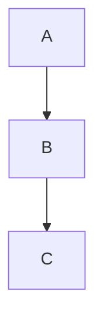

# 첫번째 헤더

이미지는  처럼 표시됨.

서식에 대한 테스트: **굵은 글씨**, 그리고 *기울어진 글씨*, 그리고 `코드블럭`은 이렇게 표시됨 [^1]

[^1]: 각주는 이렇게 표시됨

> 인용구 
> 테스트

---

코드 블럭은 아래와 같이 표시됨

```cpp
#include <iostream>

using namespace std;

int main() {
	cout << "Hello, World!" << endl;
}
```

워드 랩 테스트

```csharp
public class LocomotiveAction
{
	private void Awake()
	{
		Debug.Log("Awaked!");
		Debug.Log("Testing verrrrrry loooooooooooong Cooooooooooooooooooode");
	}
}
```

하이라이트 테스트

print("Python is good");


그리고 수식은 $$x + y + z = 10$$ 처럼 표시됨

$$
s + y
$$

위는 블록 수식임

<details>
<summary>폴더블 메뉴</summary>

```c
#include <stdio.h>
int main() { printf("Hello, World!\n"); return 0; }
```
</details>


